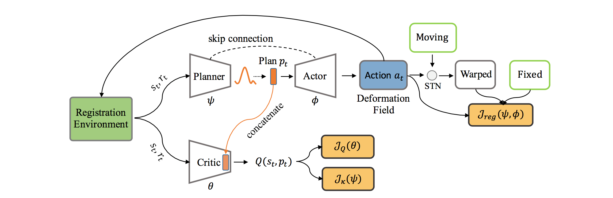

# 💉 
 RL-I2IT for Medical

## 1. Image Registration

- **Pipeline**:
  1. **Task Decomposition and Deformation Field Calculation**: Decompose the registration task into $T$ steps. Action $a_t$ is the current deformation field generated by the planner and actor. Calculate the accumulated deformation field $\Omega_{\psi,\phi}^{t}$  recursively and warp the moving image to obtain the next state._
  2. _**Reward and Auxiliary Learning**: Use the Dice score as the reward. Measure the similarity between the fixed image and the warped moving image using the local normalized cross - correlation (NCC). Use the total variation regularizer to smooth the deformation field. The final registration loss for the auxiliary learning  $_{J_{A u x}}$  is defined accordingly and used to update the planner and actor parameters.

  

- **Contribution**:
  - RL-I2IT outperforms the baseline methods over all the cases in 2D and 3D medical image registration tasks. It can handle large deformation and has better generalizability than conventional DL - based methods. The deformation fields are plausible and smooth. RL-I2IT achieves a better tradeoff between registration performance and computational efficiency.
