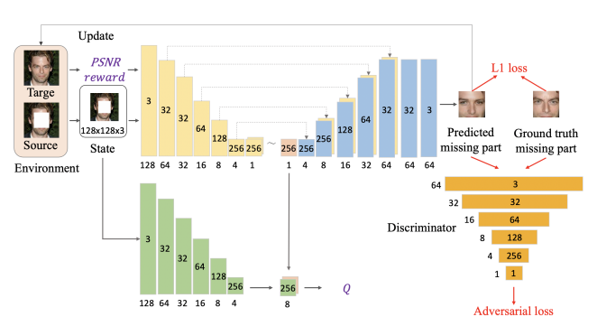
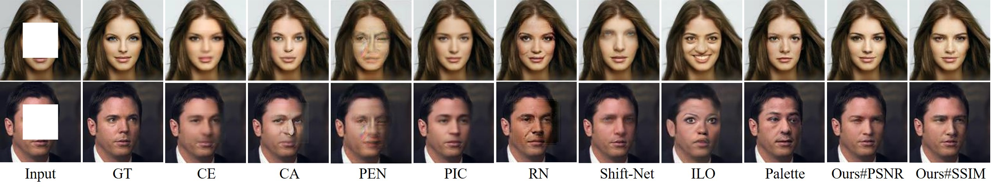
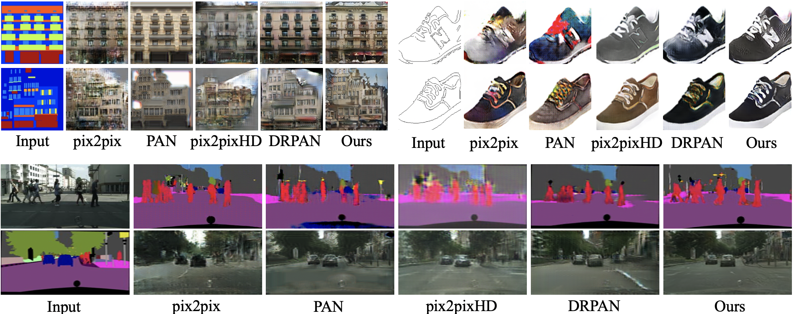
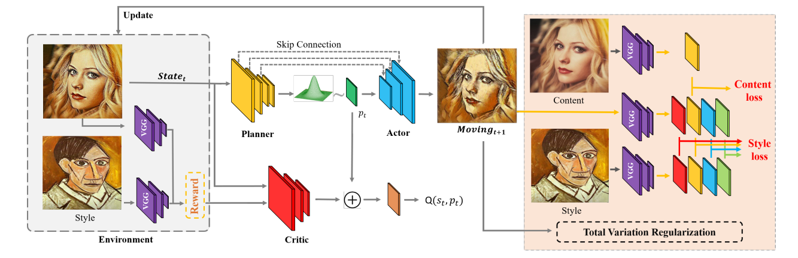
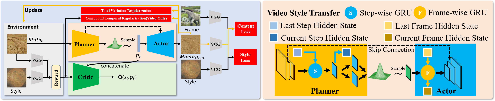
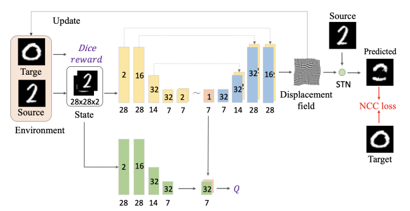
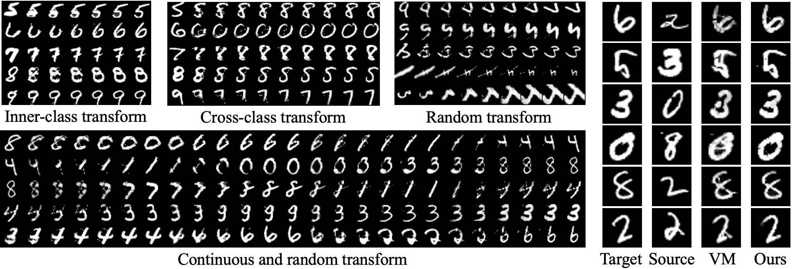

# 🎈  
 RL-I2IT for Vision

## 1. Face Inpainting

- **Pipline**
  1. **State Definition**: Use the original image with a missing region (center cropped) as the initial state, and the next state is obtained by adding the new predicted image to the missing region.
  2. **Reward Setting**: Use the peak signal-to-noise ratio (PSNR) as the reward.
  3. **Auxiliary Learning**: Apply the  $L_1$ loss with an adversarial loss for the auxiliary learning. The final auxiliary learning objective is $\mathcal{J}_{A u x}=\lambda_{rec }\mathcal{L}_{rec }+\lambda_{a d v}\mathcal{L}_{a d v}$, and update $\psi$  and $\phi$ from the planner and the actor accordingly.
  4. **Network Architecture**: For the planner - actor, use a similar architecture with context - encoder except for the skip connections and the stochastic sampling operation in the planner. Use the same network structure for all the types of discriminators except minor changes for different GANs. The convolution layers of the planner, critic, and discriminator use 4×4 kernels, and the downsampling is performed by convolution with a stride of 2. The latent action dimension is set to 256.

  

- **Contribution**
  - RL-I2IT gives obvious visual improvement for synthesizing realistic faces compared with several recent face inpainting methods. The generated faces are sharper and more natural. It achieves the best PSNR and SSIM scores when compared with the existing state-of-the-art methods on Celeba-HQ dataset.
  - The RL-I2IT framework with different GANs is stable and significantly improves the performance of training the planner - actor with SNGAN alone.

  

## 2. Realistic Photo Translation

- **Pipline**
  1. **State Definition**: Directly use the source image as the initial state. The next state is obtained by warping the generated image to the source image.
  2. **Action and Auxiliary Learning Setting**: Let the action as the predicted image directly and use the same auxiliary learning settings and network structure as in the face inpainting experiment with the PSNR reward and the SNGAN loss.
- **Contribution**
  - The proposed method significantly outperforms the pix2pix and PAN models on PSNR, SSIM, and LPIPS over all the datasets and tasks. It even achieves a comparable or better performance than the high-quality pix2pixHD and DRPAN models. The RL-I2IT has much fewer parameters and lower computational complexity compared with other models.

  

## 3. Image Style Transfer

- **Pipeline**:
  1. **State Definition**: Set the moving image as state \(s_t\), which is initialized by the content image. The moving image at time \(t\), i.e., state image \(s_{t + 1}\), is created by the actor and current state image \(s_t\) and plan \(p_t\).
  2. **Reward Setting**: Obtain the reward by measuring the difference between the current state \(s_t\) and the style image. Use negative style loss as the reward.
  3. **Network Architecture**: The planner is a neural network consisting of three convolutional layers and a residual layer. After each convolutional layer, there is an instance norm layer and a ReLU layer. The actor has three up - sampling layers. There are three skip connections between the planner and the actor. The critic consists of seven convolutional layers and one fully - connected layer at the end. Use reflection padding instead of zero padding for all the networks.
  4. **Style Learning**: Train the planner and the actor based on collected training data from the agent - environment interaction. Apply the content loss $\mathcal{L}^{C O}$ , style loss $\mathcal{L}^{S T}$ , and total variation regularization $\mathcal{L}^{T V}$ to optimize the model parameters. The final style learning loss is $\mathcal{L}=\mathcal{L}^{C O}+\lambda\mathcal{L}^{S T}+\beta\mathcal{L}^{T V}$.

  

- **Contribution**:
  - RL-I2IT provides a new solution for neural style transfer. It can learn a lightweight NST model that is applied iteratively for NST and allows a user to control the stylization degree easily.
  - RL-NST (step = 1) achieves better performance than the baseline methods in all evaluation metrics on the MS - COCO dataset. Our method still has low content and style losses even if the step is equivalent to 10. A user survey shows that the results of our algorithm are favored by the most subjects.

## 4. Video Style Transfer

- **Pipeline**:
  1. **State and Network Architecture Adjustment**: Initialize the moving images using frames. Introduce the step - wise GRU and the frame - wise GRU. The step - wise GRU retains information between steps, and the frame - wise GRU preserves information between frames.
  2. **Compound Temporal Regularization**: Add a compound temporal regularization $\mathcal{L}^{C T}$. The final style learning loss is $\mathcal{L}=\mathcal{L}^{C O}+\lambda\mathcal{L}^{S T}+\beta\mathcal{L}^{T V}+\zeta\mathcal{L}^{C T}$.

  

- **Contribution**:
  - RL-I2IT framework can achieve a diverse range of stylization levels in video style transfer. It generates stable stylized results across different degrees of stylization and promotes the stability of video style transfer.
  - Our method (step = 1 and 5) outperforms the compared methods in all style settings in terms of the average temporal losses on the MPI Sintel dataset.

## 5. DigitsTransform

- **Pipline**
  1. **State and Reward Setting**: The state is a concatenation of the predicted image and the target image. Use the Dice score as the reward.
  2. **Auxiliary Learning and Network Architecture**: Leverage the NCC loss for auxiliary learning. Use a very simple network structure to construct the planner, the actor, and the critic. The plan is a one - channel 7×7 feature map (49 - dimensional plan), and the actor outputs a deformation field, which is used to transform the source image by spatial transformer network (STN). All convolution operations use a 3×3 kernel with the LeakyReLU activation function. The downsampling operation is performed by max - pooling, and all upsampling operations are performed with the nearest interpolation.

  

- **Contribution**
  - RL-I2IT can transform digits step - wise and capture the style and shape accurately. It is robust to complex transformations and better at recovering the details and the shapes of the target digit than VoxelMorph (VM). It significantly outperforms VM over all digits both quantitatively and qualitatively.

  

